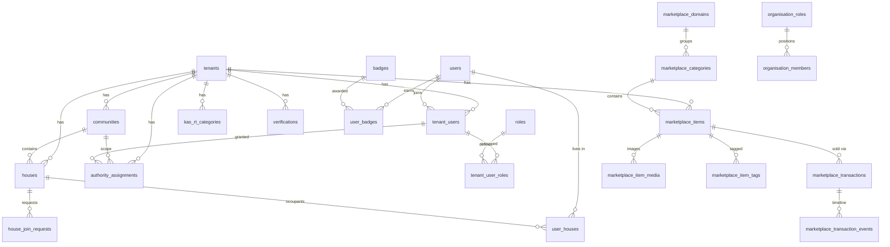

# Warga Digital — Admin Dashboard Design

> **Purpose**: Design spec for a full admin dashboard that lets RT administrators manage every entity in the Warga Digital ecosystem. This document serves as a Stitch-ready reference for building the admin pages.

---

## 1. Who Is the Admin?

Admins are users with one of these roles (via `tenant_user_roles`):

| Role | Scope | What They Manage |
|------|-------|-----------------|
| `RT_ADMIN` | TENANT | Everything within their RT community |
| `RW_ADMIN` | TENANT | Broader oversight across RTs |
| `KOPERASI_ADMIN` | TENANT | Cooperative operations & marketplace |
| `PLATFORM_ARBITER` | SYSTEM | Platform-wide moderation & disputes |

Access is enforced via the existing RBAC system: `tenant_users` → `tenant_user_roles` → `roles`. Every admin API route must verify the caller's role before executing.

---

## 2. Admin Route Structure

All admin pages live under `/admin` and are protected behind role checks.

```
src/app/admin/
├── layout.tsx                 # Admin shell (sidebar + header + guard)
├── page.tsx                   # Dashboard overview (stats + quick actions)
├── warga/
│   └── page.tsx               # Resident management (users + tenant_users)
├── rumah/
│   └── page.tsx               # House management (houses + user_houses)
├── komunitas/
│   └── page.tsx               # Community / hierarchy management
├── organisasi/
│   └── page.tsx               # Organisation structure (roles + members)
├── kas-rt/
│   └── page.tsx               # Kas RT transactions & categories
├── marketplace/
│   ├── page.tsx               # All marketplace items overview
│   ├── kategori/
│   │   └── page.tsx           # Category management
│   └── transaksi/
│       └── page.tsx           # Transaction oversight & disputes
├── verifikasi/
│   └── page.tsx               # User/house verification queue
├── otoritas/
│   └── page.tsx               # Authority assignment management
├── badge/
│   └── page.tsx               # Badge catalogue + assignment
├── join-requests/
│   └── page.tsx               # House join request moderation
└── pengaturan/
    └── page.tsx               # Tenant settings & system config
```

---

## 3. Admin Shell Layout

The admin layout differs from the mobile app shell. It must work on **desktop** (min 1024px) and degrade gracefully to tablet.

```
┌──────────────────────────────────────────────────────────────┐
│  Top Bar: "Admin Warga Digital"  │  🔔  │  Avatar ▾        │
├────────────┬─────────────────────────────────────────────────┤
│            │                                                 │
│  Sidebar   │  Main Content Area                              │
│  (240px)   │  ┌───────────────────────────────────────────┐  │
│            │  │  Breadcrumb                               │  │
│  ◉ Beranda │  │  Page Title              [+ Action Btn]   │  │
│  ◎ Warga   │  │                                           │  │
│  ◎ Rumah   │  │  Filters / Search Bar                     │  │
│  ◎ Komunitas│ │  ┌─────────────────────────────────────┐  │  │
│  ◎ Organisasi│ │ │  Data Table / Cards                 │  │  │
│  ◎ Kas RT  │  │  │  (sortable, paginated, filterable)  │  │  │
│  ◎ Marketplace│ │                                      │  │  │
│  ◎ Verifikasi│ │  │                                    │  │  │
│  ◎ Otoritas│  │  └─────────────────────────────────────┘  │  │
│  ◎ Badge   │  │                                           │  │
│  ◎ Join Req│  │  Pagination                               │  │
│  ◎ Settings│  └───────────────────────────────────────────┘  │
│            │                                                 │
└────────────┴─────────────────────────────────────────────────┘
```

- **Sidebar**: Collapsible to icons on tablet. Active item highlighted in `app-primary`.
- **Top bar**: Admin name, notification bell, role badge label.
- **Content area**: Breadcrumb → title + action → filters → data.
- Navigation should NOT use the mobile `BottomNav`.

---

## 4. Dashboard (Home) — `/admin`

The dashboard landing shows a high-level overview of the RT.

### Stat Cards (top row, 4-6 cards):

| Stat | Source | Icon |
|------|--------|------|
| Total Warga | `COUNT users WHERE status=ACTIVE` within tenant | 👥 |
| Total Rumah | `COUNT houses WHERE is_active=true` in community | 🏠 |
| Saldo Kas RT | Latest running balance from `kas_rt_transactions` | 💰 |
| Pending Verifikasi | `COUNT verifications WHERE status != 'VERIFIED'` | ✅ |
| Pending Join Requests | `COUNT house_join_requests WHERE status='PENDING'` | 📩 |
| Marketplace Items | `COUNT marketplace_items WHERE status='ACTIVE'` | 🛒 |

### Quick Actions:

- ＋ Tambah Warga (direct to `/admin/warga?action=add`)
- ＋ Catat Transaksi Kas (direct to `/admin/kas-rt?action=add`)
- ＋ Verifikasi Warga (direct to `/admin/verifikasi`)

### Recent Activity Feed:

A timeline of the last 10 actions system-wide:
- New user registrations
- Kas RT transactions
- House join requests
- Authority changes
- Marketplace item listings

---

## 5. Warga (Resident Management) — `/admin/warga`

### What It Manages

| Table | Fields |
|-------|--------|
| `users` | full_name, wa_number, email, date_of_birth, status, username, avatar_path |
| `tenant_users` | status, reputation_points, joined_at, left_at |
| `tenant_user_roles` | role assignments (WARGA, SELLER, RT_ADMIN, etc.) |
| `user_houses` | house links, relationship, is_primary |
| `user_badges` | earned badges |

### List View

| Column | Source |
|--------|--------|
| Avatar | `users.avatar_path` |
| Nama | `users.full_name` |
| No. WhatsApp | `users.wa_number` |
| Blok Rumah | `houses.blok_rumah` (via user_houses → houses) |
| Status | `users.status` + `tenant_users.status` |
| Role(s) | `tenant_user_roles` → `roles.name` (chips) |
| Bergabung | `tenant_users.joined_at` |

### Filters

- Status: ACTIVE / INACTIVE / BANNED / SUSPENDED
- Role: Multi-select from available roles
- Blok Rumah: Text search
- Search: Name or WA number

### Actions

| Action | Description |
|--------|-------------|
| View Detail | Full profile: identity, house, roles, badges, reputation |
| Edit | Change name, status, email, date_of_birth |
| Assign Role | Add/remove roles (dropdown of available roles) |
| Change Status | ACTIVE ↔ SUSPENDED ↔ BANNED (with reason modal) |
| Remove from Tenant | Set `tenant_users.status = SUSPENDED`, `left_at = NOW()`, deactivate `user_houses` |
| Assign Badge | Pick badge from catalogue and award |
| Revoke Badge | Remove a badge |

### Detail View — Tabs

1. **Profil**: Core identity fields, editable
2. **Rumah**: Linked houses (user_houses), relationship type, primary flag
3. **Role & Otoritas**: Current roles + authority assignments timeline
4. **Badge**: Earned badges with dates
5. **Aktivitas**: Recent actions log (kas transactions, marketplace activity)

---

## 6. Rumah (House Management) — `/admin/rumah`

### What It Manages

| Table | Key Fields |
|-------|------------|
| `houses` | name, blok_rumah, address, total_residents, status, is_active |
| `user_houses` | who lives here, relationship, is_primary |
| `house_join_requests` | pending requests for this house |

### List View

| Column | Source |
|--------|--------|
| Blok Rumah | `houses.blok_rumah` |
| Alamat | `houses.address` |
| Status | `houses.status` (PRIBADI / KONTRAKAN / KANTOR) |
| Jumlah Penghuni | `houses.total_residents` |
| Pemilik | Owner name from `user_houses.relationship = OWNER` |
| Active | `houses.is_active` |

### Filters

- Status: PRIBADI / KONTRAKAN / KANTOR
- Active: Yes / No
- Blok Rumah: Text search

### Actions

| Action | Description |
|--------|-------------|
| View Detail | All residents, join requests, verification status |
| Edit | Change address, status, is_active |
| Add Resident | Manually link a user (pick user → set relationship) |
| Remove Resident | Set `user_houses.status = INACTIVE` |
| Transfer Ownership | Change OWNER relationship |
| Create House | Manually add a new house entry |
| Deactivate | Set `is_active = false` |

---

## 7. Komunitas (Community Management) — `/admin/komunitas`

### What It Manages

| Table | Key Fields |
|-------|------------|
| `communities` | code, name, level (RT/RW/OTHER), parent_community_id, is_active |

### View

A tree/hierarchy view showing parent-child relationships:

```
RW 14
├── RT 01
├── RT 02
└── RT 03  ← current
```

### Actions

| Action | Description |
|--------|-------------|
| Add Community | Create new RT/RW under parent |
| Edit | Change name, code, level |
| Activate / Deactivate | Toggle `is_active` |
| Reassign Parent | Change hierarchy |
| View Members | List all houses + residents in this community |

---

## 8. Organisasi (Organisation Structure) — `/admin/organisasi`

### What It Manages

| Table | Key Fields |
|-------|------------|
| `organisation_roles` | title, sort_order (e.g. "Ketua RT", "Bendahara", "Sekretaris") |
| `organisation_members` | full_name, block_name, whatsapp_number, profile_picture_url, sort_order, user_id |

### View

A card or table view grouped by organisation role, with drag-to-reorder support.

```
Ketua RT
├── Pak Ahmad (Blok A)

Wakil Ketua
├── Bu Sari (Blok N)

Bendahara
├── Pak Budi (Blok C)

Sekretaris
├── Mba Rina (Blok B)
```

### Actions

| Action | Description |
|--------|-------------|
| Add Role | Create new organisational position |
| Edit Role | Rename or reorder |
| Delete Role | Remove (cascade deletes members) |
| Add Member | Assign user to a role position |
| Edit Member | Update name, block, WA, photo |
| Remove Member | Unlink from role |
| Reorder | Drag-and-drop sort within roles and members |

---

## 9. Kas RT (Financial Management) — `/admin/kas-rt`

### What It Manages

| Table | Key Fields |
|-------|------------|
| `kas_rt_transactions` | type (INCOME/EXPENSE), amount, description, reference, category_id, recorded_by |
| `kas_rt_categories` | name, sort_order |

### List View

| Column | Source |
|--------|--------|
| Tanggal | `created_at` |
| Kategori | `kas_rt_categories.name` |
| Deskripsi | `description` |
| Ref | `reference` |
| Tipe | INCOME (green) / EXPENSE (red) |
| Jumlah | `amount` (formatted Rp) |
| Pencatat | `recorded_by` → user name |

### Summary Cards (top)

- Total Pemasukan (all-time income sum)
- Total Pengeluaran (all-time expense sum)
- Saldo Berjalan (income − expense)
- Transaksi Bulan Ini

### Filters

- Date range picker
- Category multi-select
- Type: INCOME / EXPENSE / ALL
- Search: description or reference text

### Actions

| Action | Description |
|--------|-------------|
| Add Transaction | Form: type, amount, description, category, date |
| Edit Transaction | Modify existing (with audit trail) |
| Delete Transaction | Soft delete (with confirmation) |
| Manage Categories | CRUD for `kas_rt_categories` |
| Export Report | Download PDF or CSV of filtered transactions |

---

## 10. Marketplace — `/admin/marketplace`

### 10.1. Items Overview — `/admin/marketplace`

| Column | Source |
|--------|--------|
| Gambar | `marketplace_item_media` primary image |
| Nama | `marketplace_items.name` |
| Kategori | `marketplace_categories.name` |
| Domain | UMKM / JASA |
| Penjual | `owner_display_name` |
| Harga | `final_price` (formatted Rp) |
| Status | DRAFT / ACTIVE / SOLD_OUT / ARCHIVED |
| Featured | `is_featured` toggle |

**Actions**: Edit, Change Status, Toggle Featured, Delete

### 10.2. Kategori — `/admin/marketplace/kategori`

Manage `marketplace_domains` and `marketplace_categories`.

| Column | Source |
|--------|--------|
| Domain | UMKM / JASA |
| Nama Kategori | `name` |
| Slug | `slug` |
| Icon | `icon` emoji |
| Active | `is_active` toggle |
| Sort | `sort_order` |

**Actions**: Add Category, Edit, Activate/Deactivate, Reorder

### 10.3. Transaksi — `/admin/marketplace/transaksi`

Oversee all marketplace transactions with dispute resolution.

| Column | Source |
|--------|--------|
| ID | `marketplace_transactions.id` (short) |
| Pembeli | `buyer_user_id` → name |
| Penjual | `seller_user_id` → name |
| Item | `marketplace_items.name` |
| Total | `total_amount` (Rp) |
| Status | PENDING / CONFIRMED / IN_PROGRESS / COMPLETED / CANCELLED / REFUNDED |
| Pembayaran | UNPAID / PAID / FAILED / REFUNDED |
| Tanggal | `created_at` |

**Actions**: View Timeline (events), Change Status, Force Refund, Add Note

---

## 11. Verifikasi — `/admin/verifikasi`

### What It Manages

| Table | Key Fields |
|-------|------------|
| `verifications` | entity_type (USER/HOUSE/USER_HOUSE), entity_id, verified_by_authority_id, status |

### Queue View

A filtered list of entities pending verification or already verified.

| Column | Source |
|--------|--------|
| Tipe | USER / HOUSE / USER_HOUSE |
| Entity | Name of user or blok rumah |
| Status | VERIFIED / REVOKED / Pending |
| Diverifikasi Oleh | Authority name + type |
| Tanggal | `verified_at` |

### Actions

| Action | Description |
|--------|-------------|
| Verify | Create verification record linked to admin's authority |
| Revoke | Set `status = REVOKED` |
| View Entity | Jump to user or house detail |

---

## 12. Otoritas (Authority Management) — `/admin/otoritas`

### What It Manages

| Table | Key Fields |
|-------|------------|
| `authority_assignments` | tenant_user_id, authority_type (RT/RW/DKM/KOPERASI/SATPAM), community_id, start_date, end_date, status |

### List View

| Column | Source |
|--------|--------|
| Warga | tenant_user → user name |
| Tipe Otoritas | RT / RW / DKM / KOPERASI / SATPAM |
| Komunitas | community name |
| Mulai | `start_date` |
| Berakhir | `end_date` (or "Aktif") |
| Status | ACTIVE / REVOKED |

### Actions

| Action | Description |
|--------|-------------|
| Assign Authority | Pick user, type, community, start date |
| Revoke | Set `status = REVOKED`, `end_date = today` |
| View History | All authority records for a user |

---

## 13. Badge — `/admin/badge`

### What It Manages

| Table | Key Fields |
|-------|------------|
| `badges` | code, name, description, icon, sort_order |
| `user_badges` | user_id, badge_id, earned_at |

### Badge Catalogue View

| Column | Source |
|--------|--------|
| Icon | `badges.icon` |
| Nama | `badges.name` |
| Kode | `badges.code` |
| Deskripsi | `badges.description` |
| Penerima | `COUNT user_badges` for this badge |

**Actions**: Add Badge, Edit, Delete, View Recipients

### Award Badge

Bulk or individual: pick user(s) → pick badge → confirm.

---

## 14. Join Requests — `/admin/join-requests`

### What It Manages

| Table | Key Fields |
|-------|------------|
| `house_join_requests` | house_id, requester_user_id, status, responded_at, responded_by |

### Queue View

| Column | Source |
|--------|--------|
| Pemohon | requester user name |
| Rumah | house blok_rumah |
| Pemilik Rumah | house owner name |
| Status | PENDING / APPROVED / REJECTED |
| Tanggal | `created_at` |

### Actions

| Action | Description |
|--------|-------------|
| Approve | Create `user_houses` (FAMILY), update request status |
| Reject | Set `status = REJECTED` |
| View History | All requests for a house |

---

## 15. Pengaturan (Settings) — `/admin/pengaturan`

### Tenant Settings

| Setting | Source |
|---------|--------|
| Nama Tenant | `tenants.name` |
| Deskripsi | `tenants.description` |
| Tipe | PERUMAHAN / DESA / KOPERASI |
| Status | ACTIVE / SUSPENDED / ARCHIVED |
| Lokasi (Lat/Lng) | `tenants.latitude`, `tenants.longitude` |

### Role Management

CRUD for `roles` table:

| Field | Description |
|-------|-------------|
| name | Role name (e.g. RT_ADMIN) |
| description | Human-readable description |
| scope | SYSTEM / TENANT / HOUSE |

### System Config

- Default tenant ID, community ID, role ID (from env / seed)
- OTP provider selection (mock / clawdbot)
- Marketplace fee percentage

---

## 16. Shared UI Patterns

### Data Tables

All admin list views use a consistent data table with:

- **Column sorting** (click header to toggle asc/desc)
- **Pagination** (10 / 25 / 50 per page, with page navigation)
- **Row selection** (checkboxes for bulk actions)
- **Search bar** (top, searches across visible columns)
- **Filter chips** (active filters shown as removable chips)
- **Loading skeletons** (while fetching data)
- **Empty state** ("Belum ada data. [+ Tambah]")

### Modals & Drawers

- **Create/Edit**: Slide-in drawer from right (desktop) or full-screen modal (tablet)
- **Confirmation**: Centered modal with destructive action in red
- **Detail view**: Full-width drawer with tabs

### Forms

- Use same design tokens as the mobile app (`app-primary`, `app-surface`, etc.)
- Validation: inline error messages below fields
- Submit button: sticky at bottom of drawer

### Toasts & Notifications

- Success: Green toast (top-right), auto-dismiss 3s
- Error: Red toast, persistent until dismissed
- Warning: Yellow toast for confirmations

---

## 17. Design System Notes

The admin page should use the **same color tokens** from `globals.css`:

| Token | Usage in Admin |
|-------|---------------|
| `--color-primary` (#43a047) | Sidebar active, buttons, links |
| `--color-primary-hover` (#2e7d32) | Button hover states |
| `--color-surface` (#ffffff) | Cards, table background |
| `--color-surface-alt` (#f2faf3) | Page background |
| `--color-title` (#1f5d24) | Page headers, table headers |
| `--color-body` (#3f4b42) | Body text |
| `--color-body-muted` (#6f7d72) | Secondary text, metadata |

### Additional admin-specific tokens to add:

| Token | Value | Usage |
|-------|-------|-------|
| `--color-danger` | `#dc2626` | Delete buttons, status BANNED |
| `--color-warning` | `#f59e0b` | Status SUSPENDED, warnings |
| `--color-success` | `#16a34a` | Status ACTIVE, income, verified |
| `--color-info` | `#2563eb` | Info badges, links |

### Typography

- Admin uses the same font stack
- Page titles: `text-2xl font-bold text-app-title`
- Section headers: `text-lg font-semibold text-app-title`
- Table headers: `text-sm font-medium text-app-body-muted uppercase tracking-wide`
- Table cells: `text-sm text-app-body`

---

## 18. Auth & Permissions

### Route Guard

Every `/admin/**` route must:

1. Check `isAuthenticated` from `useAuthStore`
2. Fetch user's roles via `tenant_user_roles`
3. Verify the user has `RT_ADMIN`, `RW_ADMIN`, `KOPERASI_ADMIN`, or `PLATFORM_ARBITER` role
4. If not, redirect to `/landing` with a toast: "Anda tidak memiliki akses admin"

### API Permission Middleware

Create a reusable middleware for admin API routes:

```typescript
// src/lib/admin/require-admin.ts
async function requireAdmin(request: Request): Promise<{
  userId: string;
  tenantId: string;
  roles: string[];
}>;
```

Each API route calls this before processing. Non-admin callers receive `403 Forbidden`.

### Role-Based Visibility

Not all sections are visible to all admins:

| Section | RT_ADMIN | RW_ADMIN | KOPERASI_ADMIN | PLATFORM_ARBITER |
|---------|:--------:|:--------:|:--------------:|:----------------:|
| Warga | ✅ | ✅ | ❌ | ✅ |
| Rumah | ✅ | ✅ | ❌ | ✅ |
| Komunitas | ❌ | ✅ | ❌ | ✅ |
| Organisasi | ✅ | ✅ | ❌ | ✅ |
| Kas RT | ✅ | ✅ | ❌ | ✅ |
| Marketplace | ✅ | ✅ | ✅ | ✅ |
| Verifikasi | ✅ | ✅ | ❌ | ✅ |
| Otoritas | ❌ | ✅ | ❌ | ✅ |
| Badge | ✅ | ✅ | ❌ | ✅ |
| Join Requests | ✅ | ✅ | ❌ | ✅ |
| Pengaturan | ❌ | ❌ | ❌ | ✅ |

---

## 19. API Routes (New)

All admin API routes live under `/api/admin/`:

```
src/app/api/admin/
├── stats/route.ts                     # Dashboard statistics
├── users/
│   ├── route.ts                       # GET (list), POST (create)
│   └── [id]/
│       ├── route.ts                   # GET, PATCH, DELETE
│       ├── roles/route.ts            # GET, POST, DELETE roles
│       └── badges/route.ts           # GET, POST, DELETE badges
├── houses/
│   ├── route.ts                       # GET (list), POST (create)
│   └── [id]/
│       ├── route.ts                   # GET, PATCH, DELETE
│       └── residents/route.ts        # GET, POST, DELETE
├── communities/
│   ├── route.ts                       # GET (tree), POST
│   └── [id]/route.ts                 # GET, PATCH, DELETE
├── organisation/
│   ├── roles/
│   │   ├── route.ts                   # GET, POST
│   │   └── [id]/route.ts            # PATCH, DELETE
│   └── members/
│       ├── route.ts                   # GET, POST
│       └── [id]/route.ts            # PATCH, DELETE
├── kas-rt/
│   ├── transactions/route.ts         # GET, POST
│   ├── transactions/[id]/route.ts    # PATCH, DELETE
│   ├── categories/route.ts           # GET, POST
│   └── report/route.ts              # GET (export)
├── marketplace/
│   ├── items/
│   │   ├── route.ts                   # GET (all), POST
│   │   └── [id]/route.ts            # PATCH, DELETE
│   ├── categories/
│   │   ├── route.ts                   # GET, POST
│   │   └── [id]/route.ts            # PATCH, DELETE
│   └── transactions/
│       ├── route.ts                   # GET (all)
│       └── [id]/route.ts            # PATCH (status change)
├── verifications/
│   ├── route.ts                       # GET (queue), POST (verify)
│   └── [id]/route.ts                # PATCH (revoke)
├── authority/
│   ├── route.ts                       # GET (list), POST (assign)
│   └── [id]/route.ts                # PATCH (revoke)
├── badges/
│   ├── route.ts                       # GET (catalogue), POST (create)
│   ├── [id]/route.ts                # PATCH, DELETE
│   └── award/route.ts               # POST (bulk award)
├── join-requests/
│   ├── route.ts                       # GET (queue)
│   └── [id]/route.ts                # PATCH (approve/reject)
└── settings/
    └── route.ts                       # GET, PATCH tenant settings
```

---

## 20. Database Entity Map

Complete entity relationship for admin management:



---

## 21. Implementation Priority

Recommended build order (each phase is independently useful):

### Phase 1 — Core Admin (MVP)
- [ ] Admin shell (layout, sidebar, guard)
- [ ] Dashboard with stat cards
- [ ] Warga management (list + detail + status change)
- [ ] Rumah management (list + detail + resident linking)

### Phase 2 — Financial & Org
- [ ] Kas RT management (full CRUD + report export)
- [ ] Organisation structure management
- [ ] Join request moderation

### Phase 3 — Trust & Authority
- [ ] Verifikasi queue
- [ ] Otoritas assignment / revocation
- [ ] Badge management & awarding

### Phase 4 — Marketplace Admin
- [ ] Item oversight & moderation
- [ ] Category management
- [ ] Transaction oversight & dispute resolution

### Phase 5 — Settings & Polish
- [ ] Tenant settings
- [ ] Role management
- [ ] Activity audit log
- [ ] Bulk operations
- [ ] Data export (CSV/PDF)
