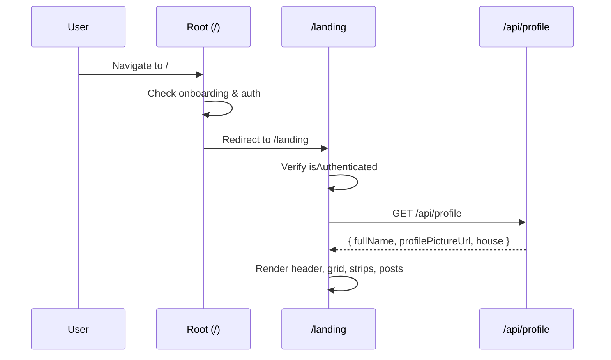

# Warga Digital — Landing Page (Home) Reference for Google Stitch

> **Purpose of this document**: Give an AI code-generation tool (Google Stitch) all the context it needs to understand, recreate, or extend the **landing / home page** of the Warga Digital application.

---

## 1. Project Overview

**Warga Digital** is a mobile-first digital ecosystem for neighborhood (RT) management in the **Sawangan Regensi RT 03** residential complex.

| Key | Value |
|-----|-------|
| Framework | Next.js 15 (App Router, Turbopack) |
| Language | TypeScript |
| UI Library | NextUI + Tailwind CSS |
| Animations | Framer Motion |
| State Management | Zustand |
| Backend | Supabase (Postgres + RLS) |
| Auth | Custom JWT (httpOnly cookies) + OTP |
| Primary Locale | Indonesian (`lang="id"`) |
| Max Viewport Width | 430 px (mobile-first, centred shell) |

---

## 2. Routing & Authentication Guard

The root page (`/`) at `src/app/page.tsx` is a **client-side redirect hub**:

```
if (!onboardingCompleted) → /onboarding
if (!isAuthenticated)     → /auth/login
else                      → /landing   ← the home page
```

The landing page itself (`/landing`) also checks `isAuthenticated` via the `useAuthStore` Zustand store — if not authenticated, the user is redirected to `/auth/login`.

**Key stores used:**
- `useOnboardingStore` — tracks if the user has completed the multi-step onboarding.
- `useAuthStore` — holds `isAuthenticated` flag and the `user` object (with `fullName`, etc.).

---

## 3. App Shell & Layout

### Root Layout (`src/app/layout.tsx`)

- Sets `<html lang="id">`.
- Wraps everything with `<Providers>` (NextUI + theme) → `<AppShell>`.
- Metadata: `title: "Warga Digital"`, `description: "Ekosistem digital Sawangan Regensi RT 03"`.

### AppShell (`src/components/app-shell.tsx`)

A mobile-chrome container that:
- Centres content with `max-width: 430px`.
- Uses `height: 100dvh` (CSS var `--app-height`).
- Adds left/right borders and a drop shadow to simulate a phone.
- Conditionally renders **BottomNav** on these routes: `/landing`, `/organisasi`, `/dompet`, `/kas-rt`, `/profil`.

```
┌───────────────────────────────────┐
│  border-x + shadow container      │ max-w-[430px], h-[100dvh]
│  ┌─────────────────────────────┐  │
│  │  children (page content)    │  │ overflow-y-auto
│  │                             │  │
│  └─────────────────────────────┘  │
│  ┌─────────────────────────────┐  │
│  │  BottomNav (conditional)    │  │ fixed at bottom
│  └─────────────────────────────┘  │
└───────────────────────────────────┘
```

---

## 4. Landing Page Structure (`/landing`)

**File**: `src/app/landing/page.tsx`

The page is a vertical scrollable column (`flex-col`, `bg-app-surface-alt`). From top to bottom:

```
┌─────────────────────────────────────┐
│  <LandingHeader>                    │  Sticky header bar
├─────────────────────────────────────┤
│  Version Banner (dismissible)       │  Optional info strip
├─────────────────────────────────────┤
│  <FeatureGrid>                      │  3×3 icon grid
├─────────────────────────────────────┤
│  <HorizontalCardStrip>             │  "Umkm RT 03" — swipeable cards
├─────────────────────────────────────┤
│  <HorizontalCardStrip>             │  "Jasa RT 03" — swipeable cards
├─────────────────────────────────────┤
│  <ResidentPostsSection>            │  "Info Warga" — vertical post list
├─────────────────────────────────────┤
│  Bottom spacing (h-6)              │
└─────────────────────────────────────┘
│  <BottomNav> (from AppShell)       │
└─────────────────────────────────────┘
```

---

## 5. Component Breakdown

### 5.1 LandingHeader

**File**: `src/components/landing/LandingHeader.tsx`

A horizontal header bar with:
- **Left side**: Avatar (initials fallback MS Teams style) → User name (bold) → Blok/rumah label (muted) → Saldo in green.
- **Right side**: Bell icon (notifications) → Hamburger icon (menu). Both are round tap targets.

```tsx
interface LandingHeaderProps {
  name?: string;                       // defaults to "Warga"
  profilePictureUrl?: string | null;   // null → initials avatar
  blokRumah?: string;                  // e.g. "Blok A - 12"
  saldo?: string;                      // e.g. "Rp 0"
  onNotificationPress?: () => void;
  onMenuPress?: () => void;
}
```

**Data source**: On mount the page fetches `/api/profile` and caches the result in a cookie via `getHeaderProfileCookie` / `setHeaderProfileCookie`. Falls back to `useAuthStore.user.fullName`.

**Visual style**: `bg-app-surface`, `shadow-sm`, text classes `text-app-title`, `text-app-body-muted`, `text-app-primary`.

---

### 5.2 Version Banner

An inline, dismissible info strip shown by default (`showVersionBanner` state):

- Background: `bg-app-primary-muted` with `border-b border-app-primary/60`.
- Text: "**Versi 1.0.0**: versi minimum yang di rilis, baru bisa pencatatan, laporan transaksi RT, lihat organisasi. selebihnya belum matang."
- Has a "Tutup" button to dismiss.

---

### 5.3 FeatureGrid

**File**: `src/components/landing/FeatureGrid.tsx`

A 3-column grid of feature shortcuts. Each feature is a rounded card (`rounded-2xl`, `bg-app-surface`, `shadow-sm`) with an emoji icon and label.

**Features (9 items)**:

| # | ID | Label | Icon | Link | Description |
|---|---|---|---|---|---|
| 1 | `administrasi` | Administrasi | 📄 | `#administrasi` | Surat Keterangan, Surat Izin, dll. |
| 2 | `kas-rt` | Kas RT | 💰 | `/kas-rt` | Pemasukan, pengeluaran, saldo RT |
| 3 | `ipl` | IPL | 🏠 | `#ipl` | Iuran bulanan perawatan |
| 4 | `jual-beli` | Jual Beli | 🛒 | `#jual-beli` | Marketplace warga |
| 5 | `jasa` | Jasa | 🔧 | `#jasa` | Layanan jasa warga |
| 6 | `event` | Event | 📅 | `#event` | Acara warga |
| 7 | `organisasi` | Organisasi | 👥 | `/organisasi` | Struktur & kontak pengurus |
| 8 | `informasi` | Informasi | ℹ️ | `#informasi` | Pengumuman & info penting RT |
| 9 | `emergency` | Emergency | 🚨 | `#emergency` | Kontak darurat & bantuan cepat |

Features with `href` starting with `/` use Next.js `<Link>` for client-side navigation; hash-only links use `<a>`.

---

### 5.4 HorizontalCardStrip (used 2×)

**File**: `src/components/landing/HorizontalCardStrip.tsx`

A horizontally-scrollable (swipeable) strip of square 160×160 px cards. Each card has:

- **Top 60%**: Image area (shows product image or a centred emoji icon in a circular badge over a white background).
- **Bottom 40%**: Title (truncated, `text-[15px]` semi-bold) and description (truncated, `text-[12px]` muted).

```tsx
interface HorizontalCardItem {
  id: string;
  imageUrl?: string | null;
  icon?: string | null;
  title: string;
  description?: string;
}

interface HorizontalCardStripProps {
  title: string;
  items: HorizontalCardItem[];
  viewAllHref?: string;   // "Lihat semua" link
}
```

**Instance 1 — "Umkm RT 03"**: Populated from `MOCK_UMKM_CATEGORIES` (Sembako 🛍️, Makanan & Minuman 🍱, Kerajinan Tangan 🎨, Sayur & Buah 🥬). Each card shows the cheapest item price as `"Mulai Rp XX.XXX"`.

**Instance 2 — "Jasa RT 03"**: Populated from `MOCK_JASA_CATEGORIES` (Kelistrikan ⚡, Jahit 🧵, Antar-Jemput 🚗, Bersih-bersih 🧹). Same price logic.

Cards have hover lift (`-translate-y-0.5`) and press scale (`scale-[0.99]`).

---

### 5.5 ResidentPostsSection

**File**: `src/components/landing/ResidentPostsSection.tsx`

A vertical list of community info / announcement cards. Each card is a `<Link>` with:

- **Top**: Image area (`h-40`), with SVG placeholder gradient if no image.
- **Bottom**: Title (truncated), excerpt (2-line clamp), author label (tiny).

```tsx
interface ResidentPostItem {
  id: string;
  title: string;
  excerpt?: string;
  imageUrl?: string | null;
  author?: string;
}
```

**Mock data (4 posts)**:

| Title | Excerpt | Author |
|-------|---------|--------|
| Bazar RT 03 – Akhir Pekan Ini | Lokasi lapangan RT. Bawa keluarga, banyak stand makanan dan kerajinan warga. | Pengurus RT 03 |
| Jasa Service AC Blok N | Bersih & isi freon. Hubungi Pak Budi 08xxx. | Blok N |
| Kumpul Kebersihan Minggu Pagi | Kerja bakti lingkungan. Meet di poskamling 06.00. | Ketua RT |
| Lelang Barang Bekas Layak Pakai | Meja, kursi, lemari. Lihat di grup WA. | Warga Blok A |

---

## 6. Bottom Navigation

**File**: `src/components/nav/BottomNav.tsx`

Fixed bottom nav bar with 4 tabs:

| Tab | Label | Route | Icon |
|-----|-------|-------|------|
| 1 | Beranda | `/landing` | House (filled when active) |
| 2 | Dompet | `/dompet` | Wallet |
| 3 | Kas RT | `/kas-rt` | Cash box with + |
| 4 | Profil | `/profil` | Person |

- Active tab text/icon use `text-app-primary`; inactive use `text-app-body-muted`.
- Has `backdrop-blur` glass effect.
- Respects `safe-area-inset-bottom`.

---

## 7. Design System & Tokens

All colours reference CSS custom properties from `globals.css`:

### Colour Palette

| Token | Variable | Default Value | Usage |
|-------|----------|---------------|-------|
| Primary | `--color-primary` | `#43a047` (green) | CTAs, links, active states |
| Primary Hover | `--color-primary-hover` | `#2e7d32` | Button hover |
| Primary Muted | `--color-primary-muted` | `#d5ead7` | Light green backgrounds |
| Surface | `--color-surface` | `#ffffff` | Card/header backgrounds |
| Surface Alt | `--color-surface-alt` | `#f2faf3` | Page background |
| Title | `--color-title` | `#1f5d24` | Heading text (dark green) |
| Body | `--color-body` | `#3f4b42` | Body text |
| Body Muted | `--color-body-muted` | `#6f7d72` | Secondary / muted text |
| Indicator Active | `--color-indicator-active` | `#43a047` | Active dot |
| Indicator Inactive | `--color-indicator-inactive` | `#d5ead7` | Inactive dot |
| Input Border | `--color-input-border` | `#e5efe7` | Form borders |
| BG Start | `--color-bg-gradient-start` | `#f8fdf9` | Body gradient top |
| BG End | `--color-bg-gradient-end` | `#f3faf5` | Body gradient bottom |

### Tailwind Custom Classes

All mapped under `colors.app.*` in `tailwind.config.ts`:

- `bg-app-primary`, `text-app-primary`, `border-app-primary`
- `bg-app-surface`, `bg-app-surface-alt`
- `text-app-title`, `text-app-body`, `text-app-body-muted`

### Typography

- Uses system fonts (via Tailwind defaults) with `antialiased` and `optimizeLegibility`.
- Headers: `text-lg font-bold text-app-title`
- Body: `text-sm` / `text-xs`, `text-app-body` or `text-app-body-muted`

### Interaction Patterns

- Cards: `rounded-2xl`, `shadow-sm`, `hover:shadow-md`, `active:opacity-90`
- Buttons: `transition 180ms ease` on colour, bg, opacity, transform
- Scrollable strips: `.scrollbar-none` (hides scrollbar, keeps scroll)
- Focus visible: Green outline ring with `outline-offset: 2px`

---

## 8. Data Flow & API

### Profile Fetch

On the landing page mount, if authenticated:

1. Check `headerProfileCookie` — if exists, use cached `{ name, profilePictureUrl, blokRumah }`.
2. Otherwise, call `GET /api/profile`.
3. Extract `house.blok_rumah` → format as `"Blok — {blok_rumah}"`.
4. Cache in cookie via `setHeaderProfileCookie()`.

### Marketplace Data

Currently **mock / static data** defined in `src/lib/constants/marketplace-catalog.ts`:

- **UMKM categories** (4): Sembako, Makanan & Minuman, Kerajinan Tangan, Sayur & Buah
- **Jasa categories** (4): Kelistrikan, Jahit, Antar-Jemput, Bersih-bersih
- **UMKM items** (6 mock products): Beras, Minyak Goreng, Nasi Uduk, Kue Lapis, Tas Rajut, Paket Sayur
- **Jasa items** (4 mock services): Instalasi Listrik, Jahit Pakaian, Ojek Kompleks, Bersih Rumah

Prices formatted with `formatRupiah()` → `"Rp 75.000"` style.

The landing page maps categories to `HorizontalCardItem[]` using `getItemsByDomain()` to find the cheapest `final_price` per category for the subtitle.

### Resident Posts

Currently **hardcoded** in `landing/page.tsx` as `RESIDENT_POSTS` array. Will eventually come from a Supabase table.

---

## 9. File Map

```
src/
├── app/
│   ├── page.tsx                        # Root redirect (→ /onboarding | /auth/login | /landing)
│   ├── layout.tsx                      # <html lang="id">, Providers, AppShell
│   ├── globals.css                     # CSS custom properties, base styles
│   ├── providers.tsx                   # NextUI + theme providers
│   └── landing/
│       └── page.tsx                    # ★ Landing page (this file)
├── components/
│   ├── app-shell.tsx                   # Mobile shell (430px max, bottom nav)
│   ├── landing/
│   │   ├── LandingHeader.tsx           # Avatar + name + saldo + bell/menu
│   │   ├── FeatureGrid.tsx             # 3×3 feature icon grid
│   │   ├── HorizontalCardStrip.tsx     # Swipeable card strip (UMKM/Jasa)
│   │   └── ResidentPostsSection.tsx    # Vertical community posts list
│   ├── nav/
│   │   └── BottomNav.tsx               # Bottom tab bar (4 tabs)
│   └── ui/
│       ├── Avatar.tsx                  # Initials-fallback avatar
│       ├── PageLoader.tsx              # Full-page loading spinner
│       └── index.ts                    # Barrel exports
├── lib/
│   ├── constants/
│   │   └── marketplace-catalog.ts      # Mock UMKM/Jasa categories & items
│   └── header-profile-cookie.ts        # Cookie helpers for header profile
├── stores/
│   ├── auth-store.ts                   # Zustand: isAuthenticated, user
│   └── onboarding-store.ts             # Zustand: onboarding completed flag
└── types/
    └── database.ts / database.generated.ts  # Supabase-generated types
```

---

## 10. Key Interactions & User Flows

### Landing Page Load Flow



### Feature Grid Tap

- Tapping a feature with `/` href → client-side `<Link>` navigation (e.g. `/kas-rt`, `/organisasi`).
- Tapping a feature with `#` href → placeholder anchor (feature not yet implemented).

### Horizontal Strip Scroll

- Swipe left/right on mobile (or scroll on desktop) to browse UMKM/Jasa categories.
- "Lihat semua" link at the top-right of each strip section.

---

## 11. Responsive & Mobile Details

- **Mobile-first**: Designed for 430px maximum width.
- **Safe areas**: `env(safe-area-inset-top)` and `env(safe-area-inset-bottom)` respected.
- **Overflow**: Main content is `overflow-y-auto overflow-x-hidden`.
- **Scrollbar hidden**: Horizontal strips use `scrollbar-none` class.
- **Touch feedback**: `active:opacity-80`, `active:scale-[0.99]` on interactive elements.
- **No desktop breakpoints**: The app always centres in a narrow phone container even on wide screens.

---

## 12. Summary for Stitch

When generating or modifying the landing page:

1. **Always wrap** content in the `AppShell` (430px container + conditional BottomNav).
2. **Use the design tokens** (`app-primary`, `app-surface`, `app-title`, etc.) — never hardcode hex values.
3. **All text is in Indonesian** (Bahasa Indonesia).
4. **Auth is required** — the page redirects unauthenticated users to `/auth/login`.
5. **Feature grid** is a 3-column icon grid; new features slot in naturally.
6. **Marketplace strips** derive from `marketplace-catalog.ts`; adding new categories/items there auto-populates the strips.
7. **Resident posts** are hardcoded for now; future work will source from Supabase.
8. **Bottom nav** has 4 tabs: Beranda, Dompet, Kas RT, Profil.
